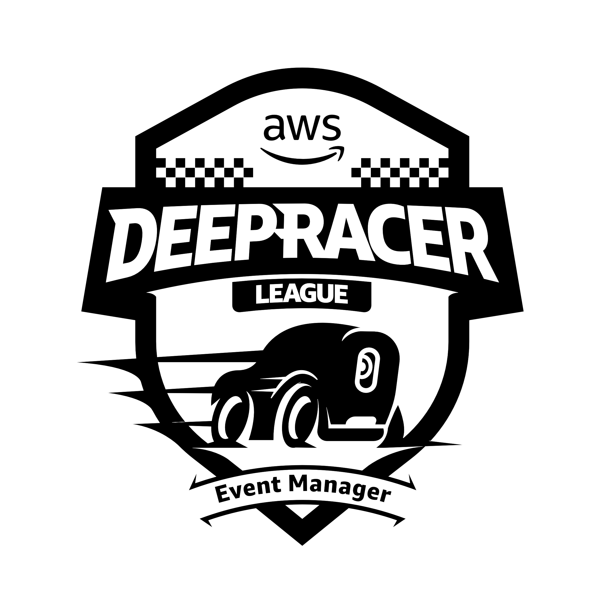
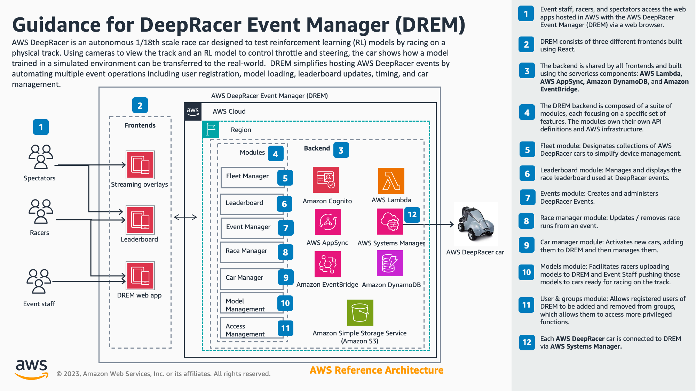

<p align="center">
	 
</p>

# Welcome to AWS DeepRacer Event Manager (DREM)

## Overview

The AWS DeepRacer Event Manager (DREM) is used to run and manage all aspects of in-person events for AWS DeepRacer, an autonomous 1/18th scale race car designed to test reinforcement learning (RL) models by racing on a physical track.

DREM offers event organizers tools for managing users, models, cars and fleets, events, as well as time recording and leaderboards. Race participants also use DREM to upload their RL models.

### Architectural overview

<p align="center">
	 
</p>

**Note:** DREM is designed for use with AWS DeepRacer cars running firmware version 20.04 and above. Earlier firmware versions are not supported. If you need to update your device, see [Update and restore your AWS DeepRacer device](https://docs.aws.amazon.com/deepracer/"latest/developerguide/deepracer-ubuntu-update.html)

## Deployment

### Deployment prerequisites

The deployment requires the following tools:

- [Docker](https://www.docker.com/) with ARM build support
- [AWS CLI](https://aws.amazon.com/cli) <span style="color:orange">\*</span>
- [AWS CDK](https://aws.amazon.com/cdk/) with Typescript support (Tested with 2.6.0) <span style="color:orange">\*</span>
- [Node.js](https://nodejs.org) version 18.x <span style="color:orange">\*</span>
- (Optional) [Make](https://www.gnu.org/software/make/) buildtool. We provide a Makefile with all required targets for easy use. We recommend installing Make. <span style="color:orange">\*</span>

<span style="color:orange">\* Included if you use docker compose</span>

### Supported regions

The deployment is currently supported in theses regions:

    US East (N. Virginia)
    US East (Ohio)
    US West (Oregon)
    Europe (Frankfurt)
    Europe (Stockholm)
    Europe (Ireland)
    Europe (London)
    Asia Pacific (Tokyo)
    Asia Pacific (Singapore)
    Asia Pacific (Sydney)

### Deployment overview

Please note: It takes approximately an hour for all of the DREM resources to be deployed.

1. [Setup environment](#step-1-setup-environment)
2. [Create a GitHub personal access token](#step-2-create-a-github-personal-access-token)
3. [Store Token in Secrets Manager](#step-3-store-token-in-secrets-manager)
4. [Install build dependencies](#step-4-install-build-dependencies)
5. [Create required build.config (if using Make)](#step-5-create-the-build-config-for-make)
6. [Bootstrap AWS CDK](#step-6-bootstrap-aws-cdk)
7. [Install DREM](#step-7-install-drem)
8. [Accessing DREM](#step-8-accessing-drem)
9. [Setup Amazon Cognito to use Amazon SES for email sending (optional)](#step-9-setup-amazon-cognito-to-use-amazon-ses-for-email-sending-optional)

### Option 1. Deploy DREM for use at an event

If you are deploying DREM for use to support your AWS DeepRacer event(s)

#### Step 1: Setup environment

In your terminal of command line, enter the following commands:

```sh
# Region where you wish to deploy
export REGION=<your-region>
# Your e-mail
export EMAIL=<your-email>
# Version to deploy, release/stable is the default, but you can pin to a version e.g. release/2.6
# Release list is available https://github.com/aws-solutions-library-samples/guidance-for-aws-deepracer-event-management/releases
export SOURCE_BRANCH=release/stable
# If you are not using the default label 'main', change this to match your environment
export LABEL=main

# Setting variables we can do programmatically.
export ACCOUNT=$(aws sts get-caller-identity --query Account --output text)

# Optional (if you have AWS CLI configured with you credentials already)
export AWS_ACCESS_KEY_ID=<key>
export AWS_SECRET_ACCESS_KEY=<secret>
export AWS_SESSION_TOKEN=<token>
```

#### Step 2: Create a GitHub personal access token

Follow the instructions on [GitHub Docs](https://docs.github.com/en/authentication/keeping-your-account-and-data-secure/creating-a-personal-access-token#creating-a-personal-access-token-classic) to create a personal access token (Classic).

When creating the token select `public_repo` for the selected scope.

#### Step 3: Store Token in Secrets Manager

Store the personal access token in Secrets Manager.

1. In the AWS Management Console, navigate to Secrets Manager
2. Click Store a new secret
3. On the Choose secret type step select Other type of secret
4. Select the Plaintext tab
5. Completely remove the example text and paste your secret with no formatting no leading or trailing spaces
6. Select the aws/secretsmanager encryption key
7. Click Next
8. On the Configure secret step set the Secret name to `drem/github-token`
9. On the Configure rotation step click Next
10. On the Review step click Store

#### Step 4: Install build dependencies

```sh
npm install
```

#### Step 5: Create the build config for Make

Note. This step is only required if Make is used for the later steps.

Build your `build.config` file

```sh
echo "region=$REGION" >> build.config
echo "email=$EMAIL" >> build.config
echo "account_id=$ACCOUNT" >> build.config
echo "label=$LABEL" >> build.config
echo "source_branch=$SOURCE_BRANCH" >> build.config
```

#### Step 6: Bootstrap AWS CDK

In this step, you bootstrap the CDK. Two options are listed below.

##### Using make

```sh
make bootstrap
```

##### Manually

```sh
cdk bootstrap -c email=$EMAIL -c account=$ACCOUNT -c region=$REGION -c source_branch=$SOURCE_BRANCH -c label=$LABEL
```

#### Step 7: Install DREM

This command creates a CodePipeline pipeline, this pipeline coordinates the build and deployment of all required DREM services.

```sh
make install
```

#### Step 8: Accessing DREM

The deployment of DREM through the pipeline will take approximately 1 hour. You can monitor the progress of the deployment by accessing the AWS Account you are deploying DREM into and going into AWS CodePipeline and reviewing the pipeline. As part of the deployment, the email address provided will become the admin user for DREM. An email with temporary credentials to access DREM as well as the a link will be sent to the email address provided. **Note:** The link won't work until the codepipeline has fully finished. When logging in for first time, the username is `admin` and the user will be prompted to change the temporary password.

#### Step 9: Setup Amazon Cognito to use Amazon SES for email sending (optional)

In the default configuration Amazon Cognito only supports 50 signups a day due to a hard limit on the number of signup emails it is allowed to send. To resolve this you must enable the [integration with Amazon SES](https://docs.aws.amazon.com/cognito/latest/developerguide/user-pool-email.html).

To manually enable this integration, you can follow these steps:

1. `Purchase/Register` your domain in `Route 53 `
   - you can use other DNS providers but those steps are not detailed here
2. `Add the domain` to the verified identities in `Amazon SES`
3. Take the SES account out of [sandbox mode](https://docs.aws.amazon.com/ses/latest/dg/request-production-access.html)
4. Navigate to your `Amazon Cognito User Pool`
5. Click `Edit` in `Messaging, Email`
6. Switch the configuration to `Send email with Amazon SES` and complete the rest of the email configuration appropriately
7. Click `Save changes`

### Option 2. Deploy DREM as a developer / contributor

#### Prerequisites

Complete all steps in [Option 1. Deploy DREM for use at an event](#option-1-deploy-drem-for-use-at-an-event)

#### Fork the DREM Repo

Make sure you have a GitHub account setup, then make a [fork](https://docs.github.com/en/pull-requests/collaborating-with-pull-requests/working-with-forks/fork-a-repo) of the [DREM repo](https://github.com/aws-solutions-library-samples/guidance-for-aws-deepracer-event-management). Forking can be done by logging into GitHub and then clicking "Fork" on the top right of the DREM repo home page.

Check the git URL for your local repo

```sh
git remote get-url origin
```

Switch the repo to your fork

```sh
git remote set-url origin <your-github-username>/guidance-for-aws-deepracer-event-management
```

#### Update build.config

Edit the build.config you created earlier add the following line, substituting the name of your repo:

```sh
source_repo=<your-github-username>/guidance-for-aws-deepracer-event-management
```

and edit the source_branch to match a branch in your fork, probably `main` to start with

```sh
source_branch=main
```

#### Deploy the updated pipeline

This command deploys the updated CodePipeline pipeline, pointing at your new fork and branch.

```sh
make install
```

#### Development prerequisites

As per the deployment prerequisites with the following additional tools

- [GIT](https://git-scm.com/)
- [Visual Studio Code](https://code.visualstudio.com/)
- Python3

A number of plugins are recommended when contributing code to DREM. VSCode will prompt you to install these plugins when you open the source code for the first time.

We recommend that you use the Makefile based commands to simplify the steps required when developing code for DREM.

If you plan to help develop DREM and contribute code, the initial deployment of DREM is the same as above. Once DREM has deployed, to make the deployed DREM stack available for local development, run the following commands, alternatively the stack can be run using docker compose to create containers for each of the three react applications that make up DREM:

### Local frontend development

Running all resources and installing all dependencies on the local machine

#### Install local dependencies

```sh
make local.install
```

#### Configure the local development environment

**Note:** You will need to have your local development environment setup/authenticated with AWS

```sh
make local.config
```

#### Run the frontend locally

To run the main DREM application

```sh
make local.run
```

To run the DREM leaderboard application

```sh
make local.run-leaderboard
```

To run the DREM streaming overlays

```sh
make local.run-overlays
```

### Docker compose based local development

Using docker compose to build and run containers for each of the react applications that make up DREM.

#### Configure the local development environment

**Note:** You will need to have your local development environment setup/authenticated with AWS

```sh
make local.config.docker
```

#### Start Docker

With docker running on your machine, use the following commands to build and start the containers. Builds the containers if they aren't already built and runs them in 'detached' mode

```sh
docker compose up -d
```

To access the logs as the containers are running

```sh
docker compose logs -f
```

To stop the containers

```sh
docker compose down
```

To rebuild a container

```sh
docker compose build --no-cache <container name>
```

To restart a container

```sh
docker compose restart <container name>
```

To run a command in a new container instance

```sh
docker compose run <container name> /bin/sh
```

To execute a command in a running container

```sh
docker compose run <container name> <command>
```

#### Backend deployment

To deploy changes to your backend (Cognito, Lambda, DynamoDB, etc.), make the updates to CDK and then commit the changes to your fork and branch that you have pointed the pipeline at and the pipeline will automatically detect and deploy the changes.

### Cleanup

When you have finished using DREM for your event, the application can be removed using either Makefile based commands or manually.

#### Step 1: Remove the pipeline

##### Using make

```sh
make clean
```

##### Manually

```sh
npx cdk destroy -c email=$EMAIL -c account=$ACCOUNT -c region=$REGION -c branch=$BRANCH
```

#### Step 2: Remove the infrastructure stack

##### Using make

```sh
make drem.clean-infrastructure
```

##### Manually

```sh
aws cloudformation delete-stack --stack-name drem-backend-$BRANCH-infrastructure --REGION $REGION
```

#### Manual clean up

Not all of the elements from the stack are able to be deleted in an automated manner and so once the initial attempt at deleting the stack has failed with `DELETE_FAILED` status you need to manually delete the stack using the console and retain the resources that can't be automatically delete. Once the stack has been deleted the retained resources can be manually deleted

`ModelsManagerClamScanVirusDefsBucketPolicy*`

(Known issue - we are looking to resolve this with an updated version of how we use ClamScanAV within DREM)

### Step 3: Remove the base stack

#### Using make

```sh
make drem.clean-base
```

#### Manually

```sh
aws cloudformation delete-stack --stack-name drem-backend-<branch-name>-base
```

#### Manual clean up

Not all of the elements from the stack are able to be deleted in an automated manner and so once the initial attempt at deleting the stack has failed with `DELETE_FAILED` status you need to manually delete the stack using the console and retain the resources that can't be automatically delete. Once the stack has been deleted the retained resources can be manually deleted

`logsBucket*`

### Step 4: Remove S3 deployment bucket

Using the console remove the S3 bucket created in step 1 of deploying DREM.

### Step 5: Remove SSM parameter

```sh
aws ssm delete-parameter --name /drem/S3RepoBucket --region $REGION
```

## Sample models

DREM has sample models trained used the reward functions in the AWS DeepRacer console that are available to load on to cars at events.

- AtoZ Speedway clockwise
  - AtoZ-CW-Centerline-tracking.tar.gz
  - AtoZ-CW-Steering-penalty.tar.gz
  - AtoZ-CW-Throttle-penalty.tar.gz
- AtoZ Speedway counter clockwise
  - AtoZ-CCW-Centerline-tracking.tar.gz
  - AtoZ-CCW-Steering-penalty.tar.gz
  - AtoZ-CCW-Throttle-penalty.tar.gz

They were trained for 12 hours using the PPO training algorithm, default discrete action space and the Hyperparameters:

- Gradient descent batch size: 64
- Number of epochs: 10
- Learning rate: 0.0003
- Entropy: 0.01
- Discount factor: 0.95
- Loss type: Huber
- Number of experience episodes between each policy-updating iteration: 20

These models can be found in `lib/default_models`

## Security

See [CONTRIBUTING](CONTRIBUTING.md#security-issue-notifications) for more information.

## License

This library is licensed under the MIT-0 License. See the [LICENSE](LICENSE.md) file.
