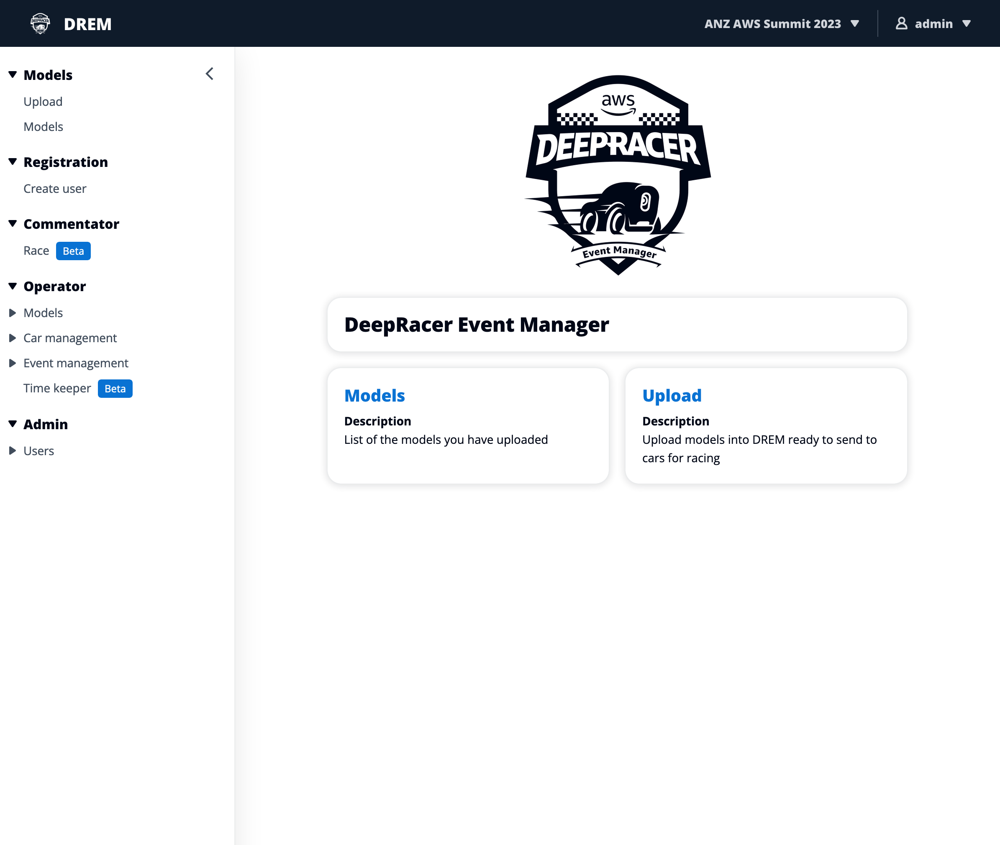

# DREM

**Note:** This documentation assumes that DREM is already installed and running.

## Definitions

Event - A time period where a number of racers will run their models on a physical track in a competition

Race - Single run by a racer based on the number of minuted as defined by the event

Fleet - Collection of cars, managed (and used) by a single person / team

## User levels

Admin - Can do anything - With great power comes great responsibility

Commentator -

Operator -

Registration - User who is able to register racers, used at larger events where people who haven't trained a model are more likely to be present and want to race using one of the event sample models

Racer - Someone who registers an account or has an account created for them, can upload and remove their models to / from DREM

## Welcome to DREM

DREM homepage when logged in as an admin user

## General interface notes

All tables can be filtered and support pagination where there are more entries available. Clicking on the settings cog next to the pagination information for the table will open a modal presenting options to personalise the page size. Filtering works across all visible columns for the table data.

# Documemtation

### User

* Model management

### Registration

* Create user

### Operator

* Models management
* [Car management](./docs-operator-car-management.md)
* [Event management](./docs-operator-event-management.md)
* Timekeeper

### Admin

* Users
* Groups

## FAQ

## Documentation notes

Screenshots were taken on a 16" MBP using [Moom](https://manytricks.com/moom/) to create a [Firefox](https://www.mozilla.org/) window size of 4x4 grid. Full length screenshots were created using the "[Screenshot](https://support.mozilla.org/en-US/kb/take-screenshots-firefox)" feature of Firefox. Screenshot resolution is 2390x2020 (for a standard length page)

Page size was set to "10"

Screen shots showing button locations are left full width, but cropped horizontally

Highlight boxes / text and arrows are all in red (#FF0000) with a 4pt stroke, square corners, font is Amazon Ember, 64pt

The default table visible columns are used unless showing a specfic value

Screenshots are placed below the task, where used numbers to highlight areas on a screen shot are placed on the top left corner

[screenshots.afphoto](./screenshots.afphoto)
