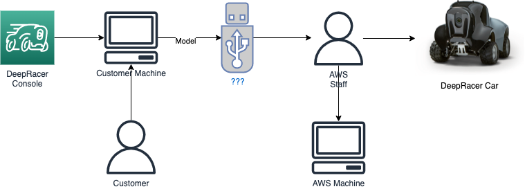
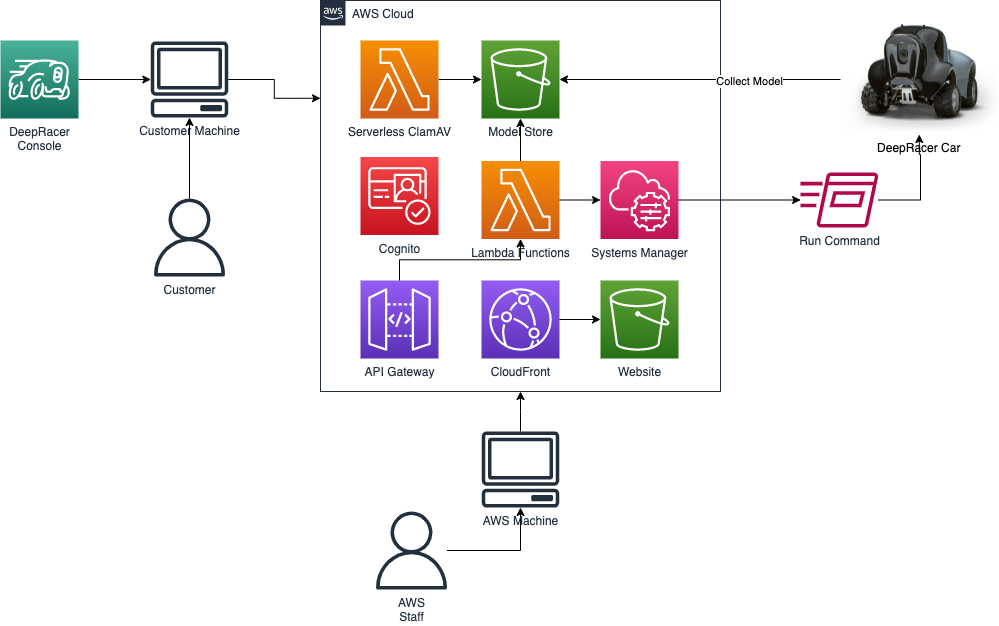

# DeepRacer Event Manager (DREM)

## Why ?

DREM fell out of some initial testing work for the DeepRacer team, at the time they were based in Seattle and didn't have access to a track (since resolved) and weren't able to get on cars to test in the physical world. To make testing easier we installed [AWS System Manager](https://docs.aws.amazon.com/systems-manager/latest/userguide/what-is-systems-manager.html) (SSM) agent on a number of cars which meant the team could access the cars as they were running on the track from "anywhere" in the world and see what was going on.

### Which led to an idea....

If we could remote on to a car via SSM from anywhere, then we could build a website which would allow people to submit their models, the organisers of a DeepRacer (DR) event could then push those models to online cars via SSM.

### ...and so DREM was born

## How ?

So previously at DeepRacer events models had to be manually collected from racers, added to USB sticks and loaded on to the car by physcially plugging the USB stick into the car. Inevitably some people had the model.tar.gz in the wrong location on the USB stick (needs to be a diretory called `models`) and some ended up having to re-download or borrow a USB stick to put their model on to.

This method led to an increased risk of maclicious files being inadvertanly uploaded to a DeepRacer device or on to a laptop as a friendly Amazonian tried to enable a racer to get going by sorting out the directory structure on a USB stick.

Now with DREM racers create an online account and upload their models, event admins then go access the admin panel in DREM and are able to select which models should be loaded to any of the DeepRacer cars which are online via SSM

As an added bonus uploaded files are also scanned using ClamAV running as an [AWS Lambda](https://aws.amazon.com/lambda/) function.

Currently the model is stored in an [S3](https://aws.amazon.com/s3/) bucket and the racers credentials using [Amazon Cognito](https://aws.amazon.com/cognito/). At this time no other information is stored about the racer or thier model.

Models uploaded into DREM are automatically removed after 15 days using a bucket life cycle policy.
