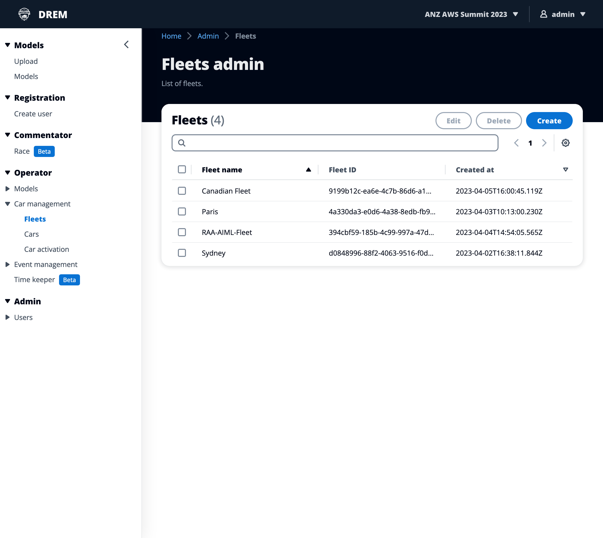
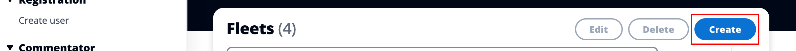
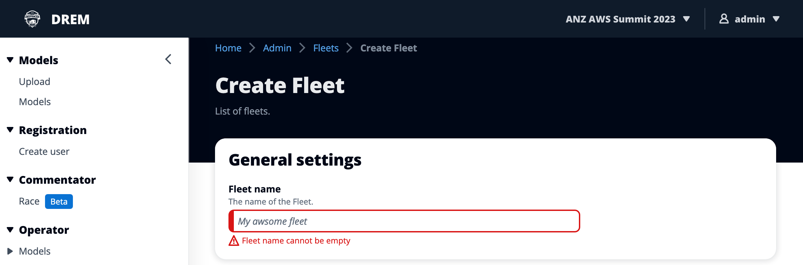
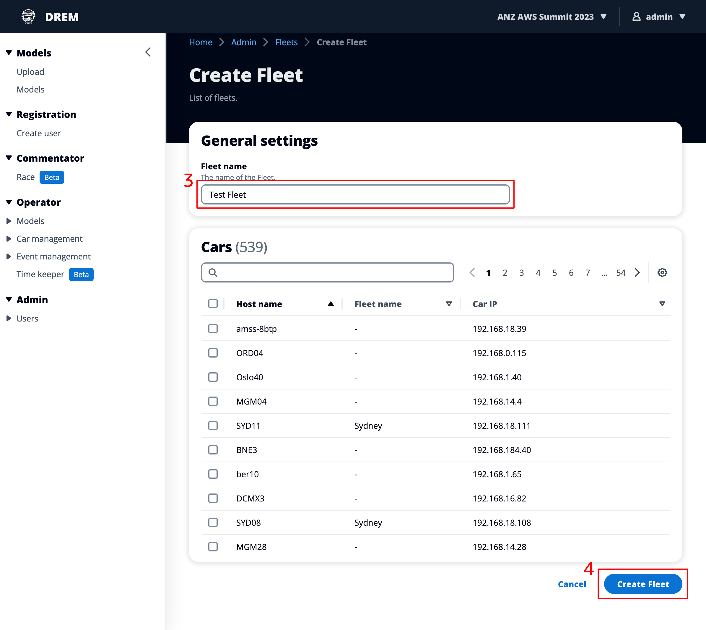
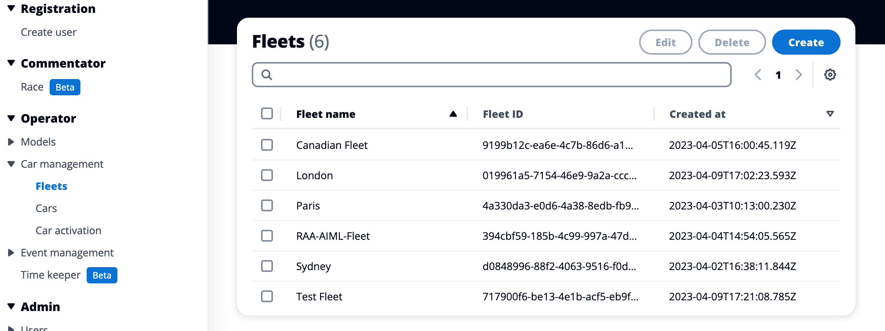
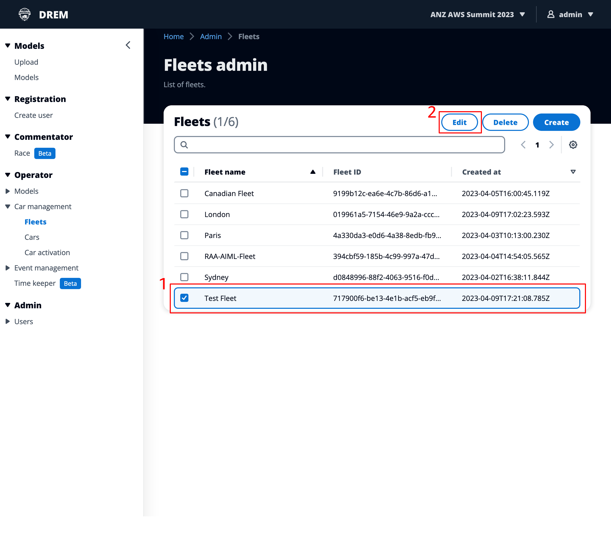
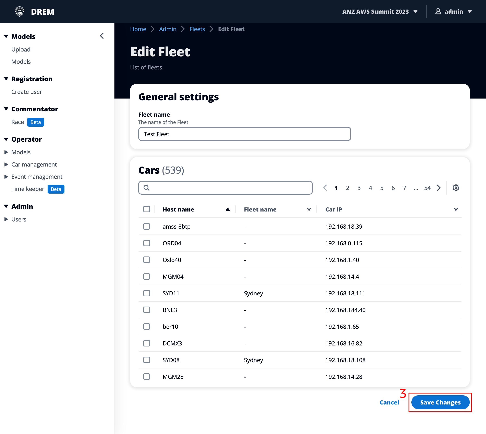

# Operator - Car management

## Fleets

-   Permissions required: Admin, Operator
-   Navigation path: Operator -> Car management -> Fleets

### Create a fleet

1. To create a new fleet click "Create" at the top of the table on the right hand side side

2. This will start the create fleet process

3. Give your fleet a name, and if you already have cars activiated with DREM you can add them to the fleet (you can also add / remove to the fleet later if you wish)

4. Press "Create fleet" to complete the process

5. Your newly created fleet will now be visible in the list of fleets

### Edit a fleet

1. Select the fleet you want to edit

2. Once you have selected a fleet the "Edit" button is enabled

3. In the edit screen, you can change the name of the fleet and also add / remove cars from the fleet, once you've made changes click on "Save changes" to return back to the fleet list

### Delete a fleet

1. Select the fleet you want to delete

2. Once you have selected a fleet the "Delete" button is enabled. Should you need to you can also select more than one fleet

3. You'll be prompted to confirm that you want to delete the fleet, clicking "Delete" will remove the selected fleets from DREM and you'll be returned to the "Fleets admin" screen

## Cars

-   Permissions required: Admin, Operator
-   Navigation path: Operator -> Car management -> Cars

## Car activation

-   Permissions required: Admin, Operator
-   Navigation path: Operator -> Car management -> Car activation
