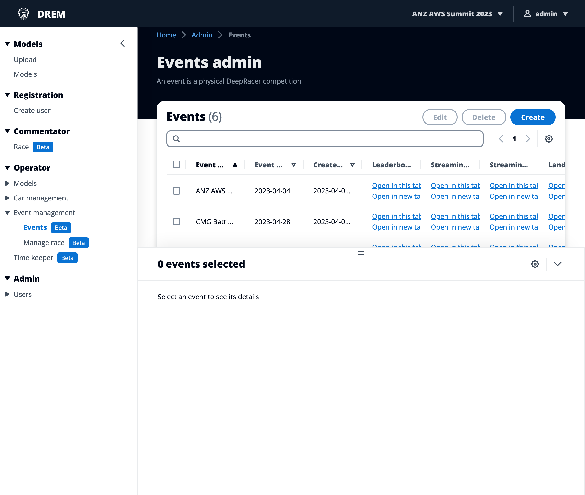
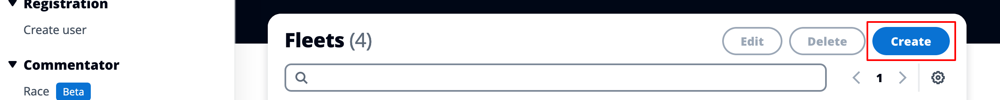
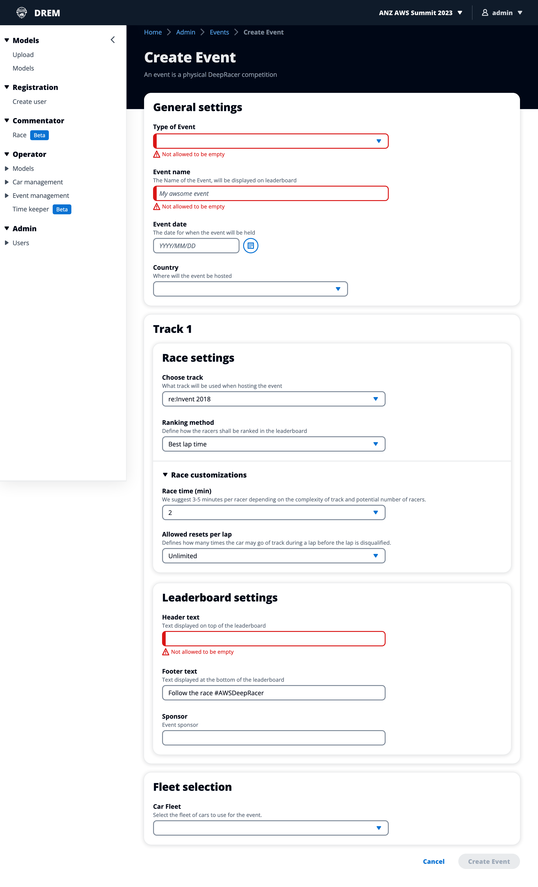
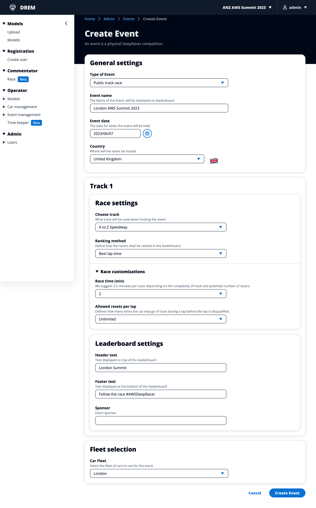
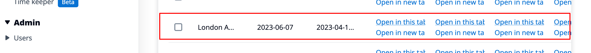
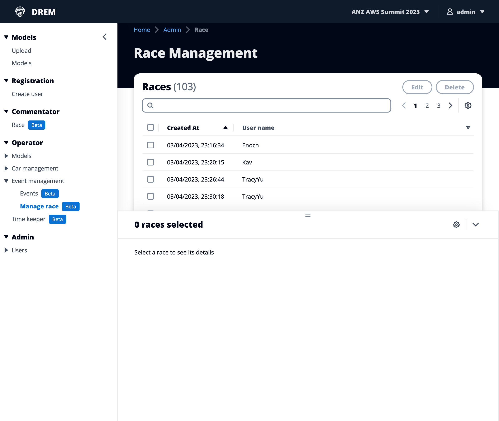

# Operator - Event management

## Events

-   Permissions required: Admin, Operator
-   Navigation path: Operator -> Event management -> Events

### Create an event

1. To create a new event click "Create" at the top of the table on the right hand side

2. This will start the create event process and you'll be presented with the form below

3. Below is a completed example for the 2023 London Summit. **note:** Race customizations is closed by default

4. Once you have filled in all of the event information click "Click event" The event will be created and you will be return to the list of events with the newly created event visible in the list

### Manage race

-   Permissions required: Admin, Operator
-   Navigation path: Operator -> Event management -> Events

