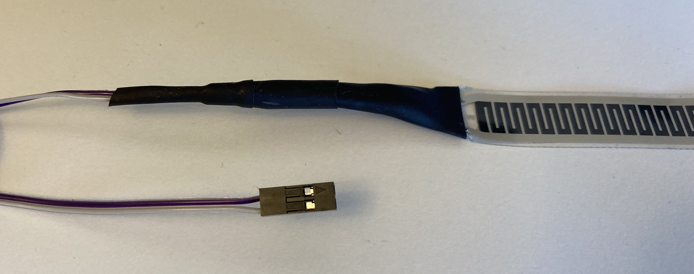
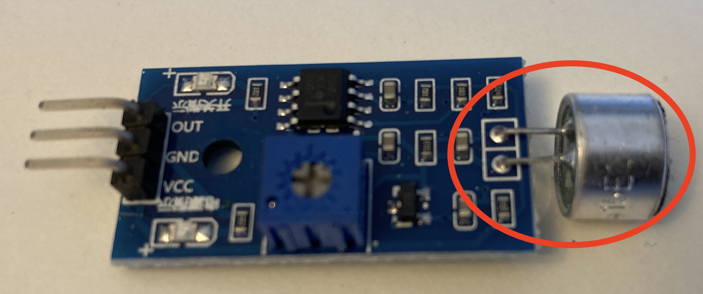
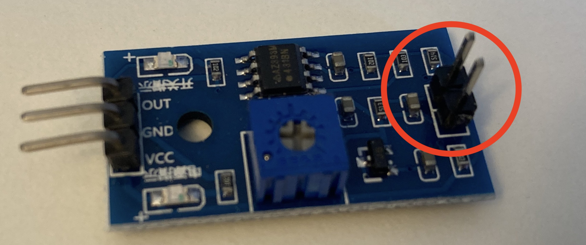
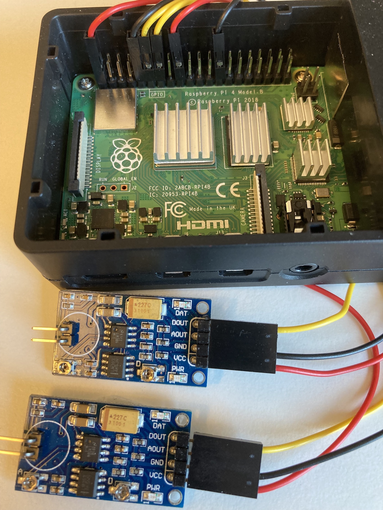
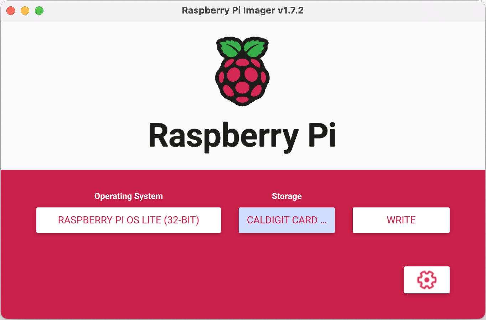
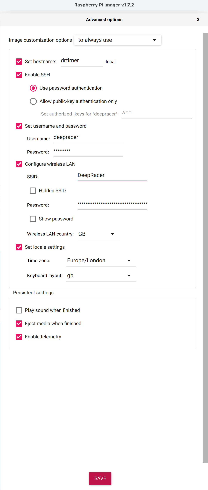
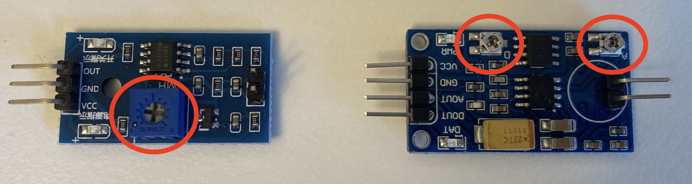
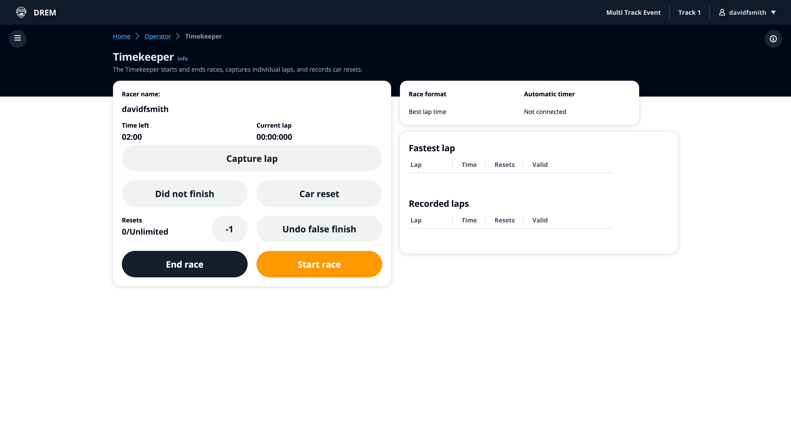
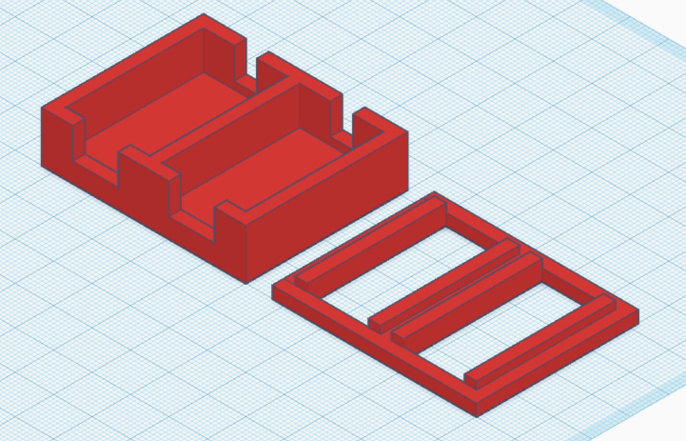

# DeepRacer Timer

The DeepRacer timer is an automated timing solution which is used togheter with the leaderboard & timekeeper system used during DeepRacer events.

## Hardware Requirements

### Required

- Rasberry Pi 4 / Zero W (known to work)
- 2x Sound Sensors [Variant 1 - Youmile (preferred)](https://www.amazon.co.uk/Youmile-Sensitivity-Microphone-Detection-Arduino/dp/B07Q1BYDS7/ref=sr_1_1_sspa?crid=YZ2AA2SUOG67&keywords=sound+sensor&qid=1655970264&sprefix=sound+sensor%2Caps%2C84&sr=8-1-spons&psc=1&smid=A3BN2T8LLIRB5S&spLa=ZW5jcnlwdGVkUXVhbGlmaWVyPUExMU5PTFY5WTlKTk8wJmVuY3J5cHRlZElkPUEwODEwNzkzM1ZCVU42MDdJQTdVUSZlbmNyeXB0ZWRBZElkPUEwNzMzMTg2MzNISEdLSjhINDRHNCZ3aWRnZXROYW1lPXNwX2F0ZiZhY3Rpb249Y2xpY2tSZWRpcmVjdCZkb05vdExvZ0NsaWNrPXRydWU=) / [Variant 2 - WaveShare](https://www.waveshare.com/sound-sensor.htm)
- 2x [Pressure sensor](https://www.amazon.co.uk/gp/product/B07PM5PTPQ)
- 2X 1.5m, two core flat wire between sound sensor and pressure sensors
- Soldering iron

### Optional

- PoE hat / case for Pi Zero [https://www.waveshare.com/poe-eth-usb-hub-box.htm]()
- PoE splitter (for use with Pi 4) [https://www.amazon.co.uk/gp/product/B0832QR4NG]()

**Note:** only required if you intend to use a PoE switch at the track for powering AP's and the Raspberry Pi

## Hardware Setup

### Preassure sensors

- Solder a 1.5 m, two core wire to each preassure sensor. Isolate each solder with a heat shrink tube
- Attach a two pin female connector to the other end of the wire
  

### Ambient sound sensors

- Replace the speaker on each board with a two pin male connector
  
  

- Connect the output male connector to the RPI GPIO pins
  

| Cable  | Sound sensor | RPI 4                             |
| ------ | ------------ | --------------------------------- |
| Red    | VCC          | +3.3V, Pin 1 & 17                 |
| Black  | GND          | Pin 9 & 25                        |
| Yellow | DOUT         | Pin 11 (GPIO17) & Pin 13 (GPIO27) |

## Software setup

### Raspberry Pi Operating System

To install the Raspberry Pi (RPi) OS on an SD card the recommended approach is using the [Raspberry Pi Imager](https://www.raspberrypi.com/software/)

Once installed choose the one of the following images based on the RPi being used.

- RPi 4 : Raspberry Pi OS (Other) -> Raspberry Pi OS Lite (64-bit)
- RPi Zero W : Raspberry Pi OS (Other) -> Raspberry Pi OS Lite (32-bit)



**Note:** Screen shot is for an RPi Zero W

Once you've selected your OS click on settings to configure the advanced settings.



Here you can set the device hostname, password, enabale SSH and (optionally) configure the WiFi settings.

For the username we recommend you use: `deepracer` as this is the expected value used in the service definition.

**Important:** The [service-definition/deepracer-timer.service] is configured to expect the RPi username to be `deepracer`, if you use a different username you will need to change the following lines for the `WorkingDirectory` and `ExecStart` paths and also the `User` before running `service-setup.js`

```
WorkingDirectory=/home/deepracer/deepracer-timer
ExecStart=node /home/deepracer/deepracer-timer/timer.js
Restart=on-failure
User=deepracer
```

Once the SD card has been written, eject it from your computer, insert into the RPi and boot it up.

### DeepRacer Timer Service

Copy the zip file `deepracer-timer.zip` from this repo to the Raspberry Pi and unzip

    scp deepracer-leaderboard-timer.zip deepracer@<RPI IP>:~/
    ssh deepracer@<RPI IP>
    unzip deepracer-leaderboard-timer.zip
    cd deepracer-leaderboard-timer

Run `pi-update.sh` to update everything on the Raspberry Pi and install Node

    sudo ./pi-update.sh

Should update all packages and install node, tested and working on (PRs welcome for fixes):

- Pi Zero W
- Pi 4

Next up run `servce-setup.sh` to install timer as a service

    sudo ./service-setup.sh

If you get an error with the service you can check the status of it using

    sudo systemctl status deepracer-timer.service

And also check the journal for more detail

    journalctl -e

And disable the service using

    sudo systemctl disable deepracer-timer.service

If for whatever reason you are unable to use the service the timer code can be run in a loop with the command

    ./run_timer.sh

## Pressure sensor positioning

The pressue sensors work best when they are positioned at the back of the start / finish line and not the front (so the car has crossed the majoirity of the start / finish line before touching the sensors) and when positioning a car to start a race, it can be placed 50cm from the start / finish line.

## Calibration

The Youmile sound sensor boards have one screw (easier to use) for calibration whereas the WaveShare sound sensor boards have two screws for claibrcalibrationation, turn the screws to increase/decrease the trigger sensitivity.



- If laps are triggered but nothing has touched the preassure sensors.Turn the screw(s) slowly until there is only one led lit.

- If no laps are triggered. Turn the screw(s) so that both leds are lit and then slowly back until there is only one led lit.

## Verify that the timer works

- Go to `http://<RPI IP>:8080/admin/` using a private window in Chrome or Firefox
- Log in using timerkeeper credentials
- Select the event you are running from the list of events you have access to
- Use `Registration` and add a racer, click on the DeepRacer logo (top right) to go back to the event timer home page
- Use `Timekeeper` select the racer you just added and test
- Start the race and press the pressure sensors. This should trigger a new lap on the timekeeper website

## Ready to Race ?

When using the automatic timer, select the racer and have the timer on the `READY TO GO?` screen, when the car crosses the start / finish line for the first time the clock will start ticking down and the lap timer will start. This is also the case if for whatever reason a race is paused, once the car crosses the line again the clock resumes.



## Sensor Holder

There is an `.stl` file to print out the sensor box choose the right `.stl` file for the sensors you have.

- [Timerbox Youmile sensors](./stl/timerbox_youmile.stl)
- [Timerbox WaveShare sensors](./stl/timerbox_waveshare.stl) - slightly larger sensors



## Developers

When updating the code please create a new `deepracer-leaderboard-timer.zip` file to make this easier to setup - Thank you.

From the parent directory:

```
zip -r deepracer-leaderboard-timer.zip deepracer-leaderboard-timer -x "*.git*" -x "*node_modules*" -x "*stl*" -x "*.DS_Store"
```

## TODO

- Better documentation
