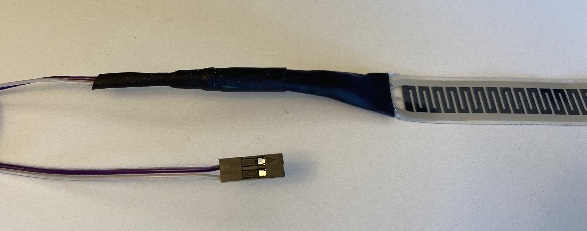
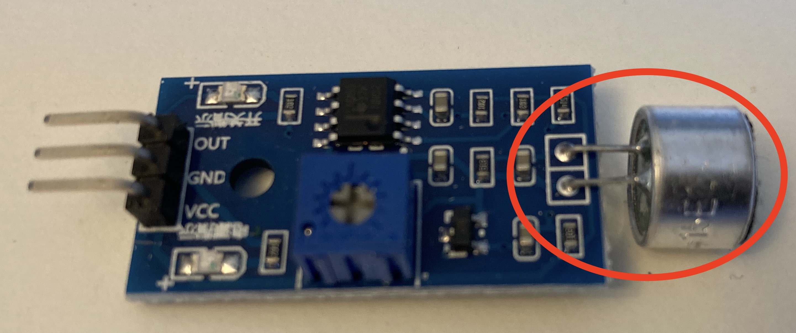
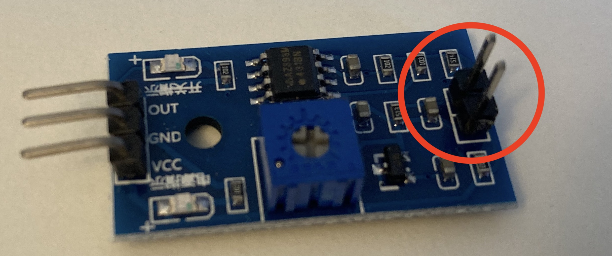
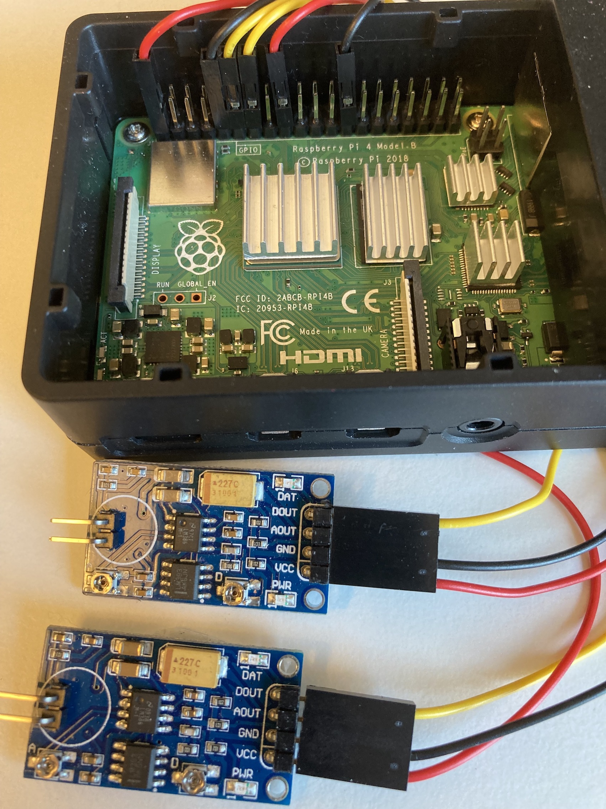
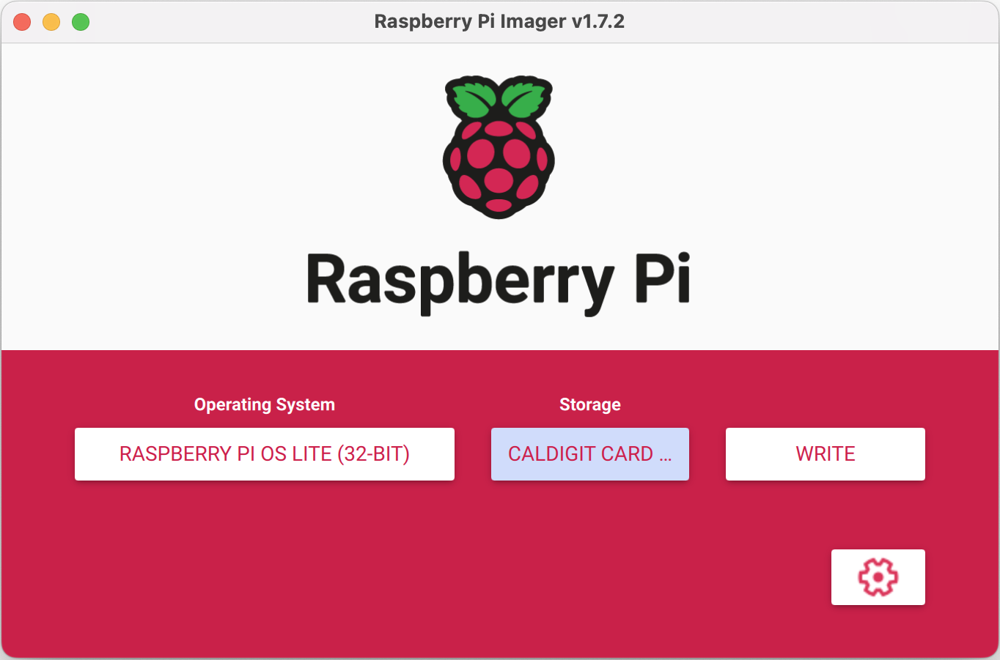
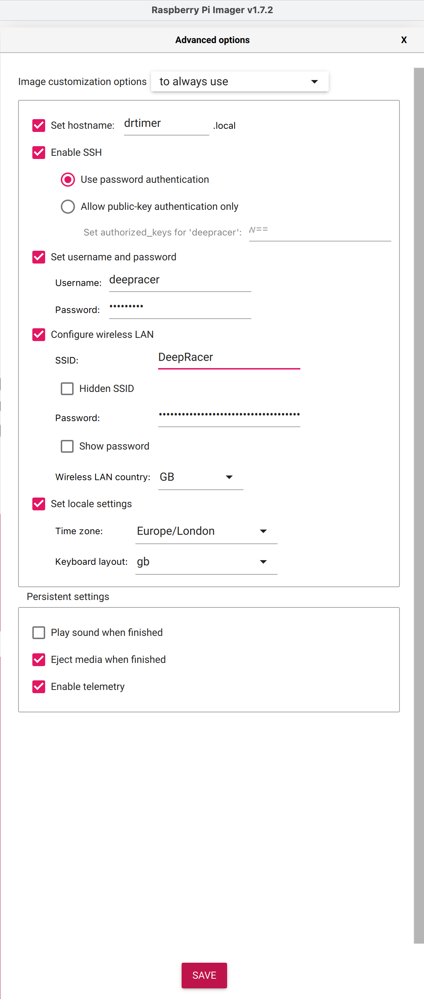
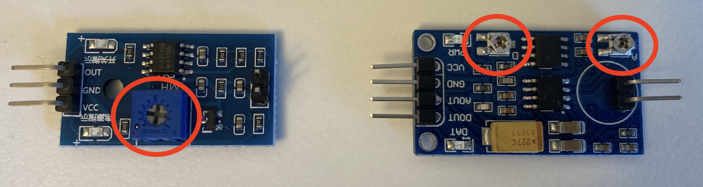
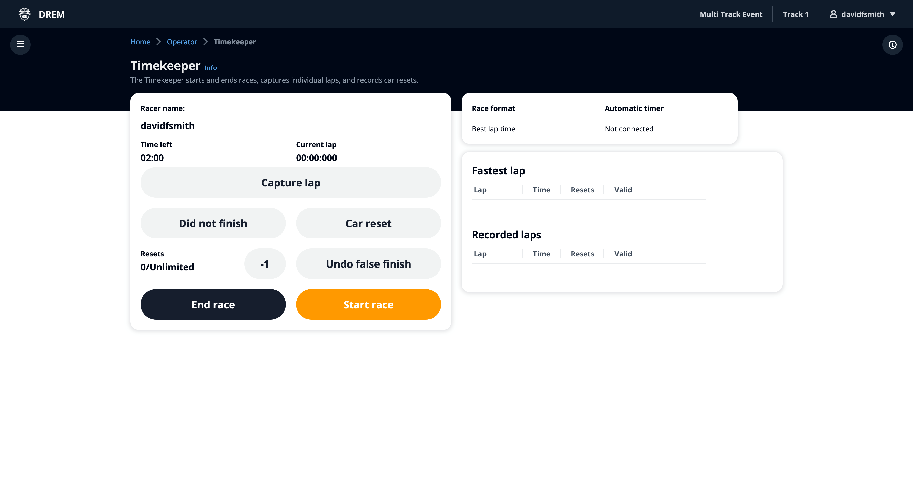
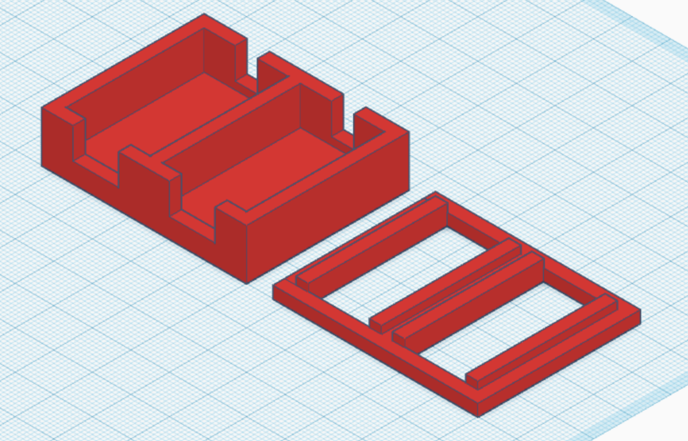

# DeepRacer Timer

The DeepRacer timer is an automated timing solution which is used together with the leaderboard & timekeeper system used during DeepRacer events.

### Important Updates (v2.0)

**Broad Raspberry Pi Support**

- Compatible with all Raspberry Pi models: RPi 1/2/3/4/5, Zero W, Zero 2W, Compute Modules
- Uses `node-libgpiod` (libgpiod character device interface) on all modern installs — unaffected by the kernel 6.x sysfs GPIO renumbering
- Automatic fallback to `rpi-gpio` for pre-kernel-6.x systems (not recommended)
- Recommended Raspberry Pi OS Bookworm or newer. Ubuntu will work, but installation script might need some manual tweaking. Older Raspberry Pi OS may also work.

**Enhanced Timing Accuracy:**

- Server-side timestamps capture exact trigger time (eliminates network latency)
- Per-sensor debounce tracking (configurable, default 2 seconds)
- Improved reliability and logging

## Hardware Requirements

### Supported Devices

- Raspberry Pi 5 / Compute Module 5
- Raspberry Pi 4 / Compute Module 4
- Raspberry Pi Zero 2W
- Raspberry Pi Zero W
- Raspberry Pi 3 / Compute Module 3
- Raspberry Pi 1 / Zero / Compute Module 1 (ARMv6)

**Performance Notes:**

- **Pi 5 & Pi 4**: Excellent performance, handles multiple simultaneous connections easily
- **Pi Zero 2W**: Good performance, quad-core processor, recommended upgrade from Zero W
- **Pi Zero W**: Works well for single timing station, limited by single-core processor

All models provide accurate timing - the performance differences mainly affect WebSocket connection handling and system responsiveness.

### Required

- 2x Sound Sensors [Variant 1 - Youmile (preferred)](https://www.amazon.co.uk/Youmile-Sensitivity-Microphone-Detection-Arduino/dp/B07Q1BYDS7/ref=sr_1_1_sspa?crid=YZ2AA2SUOG67&keywords=sound+sensor&qid=1655970264&sprefix=sound+sensor%2Caps%2C84&sr=8-1-spons&psc=1&smid=A3BN2T8LLIRB5S&spLa=ZW5jcnlwdGVkUXVhbGlmaWVyPUExMU5PTFY5WTlKTk8wJmVuY3J5cHRlZElkPUEwODEwNzkzM1ZCVU42MDdJQTdVUSZlbmNyeXB0ZWRBZElkPUEwNzMzMTg2MzNISEdLSjhINDRHNCZ3aWRnZXROYW1lPXNwX2F0ZiZhY3Rpb249Y2xpY2tSZWRpcmVjdCZkb05vdExvZ0NsaWNrPXRydWU=) / [Variant 2 - WaveShare](https://www.waveshare.com/sound-sensor.htm)
- 2x [Pressure sensor](https://www.amazon.co.uk/gp/product/B07PM5PTPQ)
- 2X 1.5m, two core flat wire between sound sensor and pressure sensors
- Soldering iron

### Optional

- PoE hat / case for Pi Zero [https://www.waveshare.com/poe-eth-usb-hub-box.htm]()
- PoE splitter (for use with Pi 4) [https://www.amazon.co.uk/gp/product/B0832QR4NG]()

**Note:** only required if you intend to use a PoE switch at the track for powering AP's and the Raspberry Pi

## Hardware Setup

For the timer you can build your own sensors or purchase timing boards from [Digital Racing Kings](https://digitalracingkings.com/)

### pressure sensors

- Solder a 1.5 m, two core wire to each pressure sensor. Isolate each solder with a heat shrink tube
- Attach a two pin female connector to the other end of the wire
  

### Ambient sound sensors

- Replace the speaker on each board with a two pin male connector
  
  

- Connect the output male connector to the RPI GPIO pins
  

| Cable  | Sound sensor | RPI 4                             |
| ------ | ------------ | --------------------------------- |
| Red    | VCC          | +3.3V, Pin 1 & 17                 |
| Black  | GND          | Pin 9 & 25                        |
| Yellow | DOUT         | Pin 11 (GPIO17) & Pin 13 (GPIO27) |

## Software setup

### Raspberry Pi Operating System

To install the Raspberry Pi (RPi) OS on an SD card the recommended approach is using the [Raspberry Pi Imager](https://www.raspberrypi.com/software/)

Once installed choose the one of the following images based on the RPi being used.

**Recommended OS: Raspberry Pi OS Bookworm (or newer), 32-bit or 64-bit**

| Device                  | Recommended OS                               |
| ----------------------- | -------------------------------------------- |
| RPi 5 / CM5             | Raspberry Pi OS (64-bit) - Bookworm or later |
| RPi 4 / CM4             | Raspberry Pi OS (64-bit) - Bookworm or later |
| RPi Zero 2W             | Raspberry Pi OS (64-bit) - Bookworm or later |
| RPi Zero W / Zero / CM1 | Raspberry Pi OS (32-bit) - Bookworm or later |



**Note:** Bookworm ships with Linux kernel 6.x, which is required for the `node-libgpiod` GPIO library used by the timer. Bullseye and earlier are not recommended.

Once you've selected your OS click on settings to configure the advanced settings.



Here you can set the device hostname, password, enabale SSH and (optionally) configure the WiFi settings.

For the username we recommend you use: `deepracer` as this is the expected value used in the service definition.

**Important:** The [service-definition/deepracer-timer.service] is configured to expect the RPi username to be `deepracer`. The activation script updates these automatically, but if you are setting up manually with a different username you will need to edit the following lines:

```
WorkingDirectory=/home/deepracer/deepracer-timer
ExecStart=node /home/deepracer/deepracer-timer/timer.js
Restart=on-failure
User=deepracer
```

Once the SD card has been written, eject it from your computer, insert into the RPi and boot it up.

### Node.js Installation

The timer requires **Node.js 18 LTS** or later. The DREM activation script installs Node.js v18.20.8 automatically. To install it manually:

```bash
# Install Node.js 18 LTS
curl -fsSL https://deb.nodesource.com/setup_18.x | sudo -E bash -
sudo apt-get install -y nodejs

# Verify installation
node --version  # Should show v18.x.x
npm --version
```

### Time Synchronization (Important for Accuracy)

For accurate timing, ensure your Raspberry Pi's clock is synchronized with NTP:

```bash
# Check NTP status
timedatectl status

# If NTP is not active, enable it
sudo timedatectl set-ntp true

# Verify synchronization
sudo systemctl status systemd-timesyncd
```

The timer now captures timestamps on the device itself (not in the browser), which eliminates network latency from timing measurements. However, accurate time synchronization ensures consistency across multiple timing sessions and with other systems.

**Network Latency Considerations:**

- The timer captures the exact moment the GPIO triggers using high-precision timestamps
- These timestamps are sent to the browser along with the lap event
- Network latency only affects display updates, not the actual lap time measurements
- Typical latency: 10-50ms on local network, negligible impact on timing accuracy

### DeepRacer Timer Service

Go to `Device Management -> Timer activation` in DREM, select a fleet and enter a hostname for the RPi and click `Generate`

Clicking on the `Copy` button copies the activation script to your clipboard, SSH into your RPi and run the command, this will download the timer script from DREM, update your RPi with the required dependencies and install the timer service, finally the device will have AWS SSM agent installed.

This process has been tested on:

- Pi Zero W (32-bit OS)
- Pi Zero 2W (64-bit OS recommended)
- Pi 4 (64-bit OS)
- Pi 5 (64-bit OS, Bookworm)

If you get an error with the service you can check the status of it using

    sudo systemctl status deepracer-timer.service

And also check the journal for more detail

    journalctl -e

And disable the service using

    sudo systemctl disable deepracer-timer.service

If for whatever reason you are unable to use the service the timer code can be run in a loop with the command

    ./run_timer.sh

## Pressure sensor positioning

The pressure sensors work best when they are positioned at the back of the start / finish line and not the front (so the car has crossed the majority of the start / finish line before touching the sensors) and when positioning a car to start a race, it can be placed 50cm from the start / finish line.

## Calibration

The Youmile sound sensor boards have one screw (easier to use) for calibration whereas the WaveShare sound sensor boards have two screws for calibration, turn the screws to increase/decrease the pressure strip sensitivity.



- If laps are triggered but nothing has touched the pressure sensors.Turn the screw(s) slowly until there is only one led lit.

- If no laps are triggered. Turn the screw(s) so that both leds are lit and then slowly back until there is only one led lit.

## Verify that the timer works

- Go to `http://<RPI IP>:8080/admin/` using a private window in Chrome or Firefox
- Log in using timekeeper credentials
- Select the event you are running from the list of events you have access to
- Use `Registration` and add a racer, click on the DeepRacer logo (top right) to go back to the event timer home page
- Use `Timekeeper` select the racer you just added and test
- Start the race and press the pressure sensors. This should trigger a new lap on the timekeeper website

## Ready to Race ?

When using the automatic timer, select the racer and have the timer on the `Start race?` screen, when the car crosses the start / finish line for the first time the clock will start ticking down and the lap timer will start. This is also the case if for whatever reason a race is paused, once the car crosses the line again the clock resumes.



## Sensor Holder

There is an `.stl` file to print out the sensor box choose the right `.stl` file for the sensors you have.

- [Timerbox Youmile sensors](./stl/timerbox_youmile.stl)
- [Timerbox WaveShare sensors](./stl/timerbox_waveshare.stl) - slightly larger sensors



## Configuration

Configuration is done by editing the `config` object near the top of [timer.js](timer.js).

After editing, restart the service:

```bash
sudo systemctl restart deepracer-timer.service
```

### Configuration Options

- **dremUrl**: The DREM server URL (set automatically during activation)
- **port**: HTTP/WebSocket server port (default: 8080)
- **gpio.sensor1**: BCM GPIO number for first sensor (default: 17, physical pin 11)
- **gpio.sensor2**: BCM GPIO number for second sensor (default: 27, physical pin 13)
- **gpio.debounceMs**: Debounce time in milliseconds per sensor (default: 2000)

### Adjusting Debounce

If you experience:

- **Missed laps**: Decrease `debounceMs` (e.g., 1500ms)
- **False triggers**: Increase `debounceMs` (e.g., 3000ms)

The debounce is applied per sensor independently, preventing a sensor from triggering multiple times within the configured window.

### GPIO Pin Mapping

The default configuration uses:

- **Sensor 1**: GPIO17 (Physical pin 11)
- **Sensor 2**: GPIO27 (Physical pin 13)

These match the hardware setup described in this guide. Only change these if you've wired the sensors to different GPIO pins.

## Troubleshooting

### Check which GPIO library is being used

View the service logs to confirm `node-libgpiod` loaded successfully:

```bash
sudo journalctl -u deepracer-timer.service -f
```

Look for lines like:

- `Using node-libgpiod (modern GPIO library - requires kernel > 6.x)` — expected on all Bookworm installs
- `Using rpi-gpio (legacy GPIO library - requires kernel < 6.x)` — only on very old OS images, not recommended

### Timing accuracy verification

The timer logs each lap with:

- Timestamp in milliseconds
- GPIO pin that triggered
- Per-sensor lap count

Example log output:

```
15: Lap triggered - GPIO17 at 1709845234567 (2024-03-07T16:13:54.567Z)
```

### Common issues

**No laps detected:**

1. Check sensor calibration (see Calibration section)
2. Verify GPIO connections
3. Check service status: `sudo systemctl status deepracer-timer.service`

**Multiple laps from single trigger:**

1. Increase debounce time in config
2. Check pressure sensor placement

**WebSocket connection issues:**

1. Verify Pi is accessible on port 8080
2. Check firewall settings: `sudo ufw status`

## Developers

When updating the code please create a new `leaderboard-timer.zip` file to make this easier to setup - Thank you.

From the parent directory:

```
zip -r website/public/leaderboard-timer.zip leaderboard-timer -x "*.git*" -x "*node_modules*" -x "*stl*" -x "*.DS_Store" -x "*package-lock.json"
```
